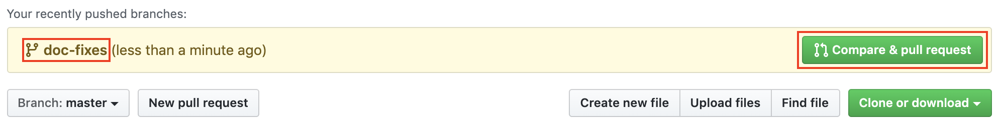

# TVVS Static Analysis
FEUP TVVS Static Analysis Lecture

This project has the proposal to show SonarLint and SonarCloud working with Intellij and Github Actions to code review a small Java H2 example.

[](https://sonarcloud.io/dashboard?id=kadubarral_java-simple-h2)
[](https://sonarcloud.io/dashboard?id=kadubarral_java-simple-h2)
[](https://sonarcloud.io/dashboard?id=kadubarral_java-simple-h2)
[](https://sonarcloud.io/dashboard?id=kadubarral_java-simple-h2)
[](https://sonarcloud.io/dashboard?id=kadubarral_java-simple-h2)


## Setup Activities
Fork this project


Clone the project that you forked
```
git clone https://github.com/YOUR_NAME/tvvs-staticanalysis.git
```

Branch
```
git checkout main
git pull upstream main && git push origin main
git checkout -b upXXXXXXXXX/static-analysis-fix
```

## Fix the issues
Work in your machine
```
cd tvvs-staticanalysis
```

Static Test is not about to execute the code, but if you want to run locally you can use maven.
```
mvn clean compile exec:java
```

#### To help your work
* See the actual report of issues on SonarCloud
  * https://sonarcloud.io/dashboard?id=kadubarral_tvvs-staticanalysis
* Use SonarLint report on Intellij 

## Send your code
Commit and push
```
git add -A
git commit -m "fix a lot of issues in this horrible code"
git push origin upXXXXXXXXX/static-analysis-fix
```

Create the PR


### Group Members
* Kadu Barral
* Sadra Farshid

